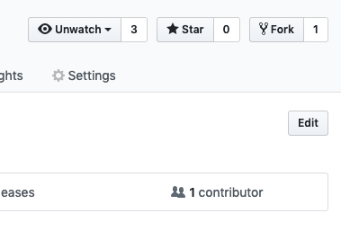
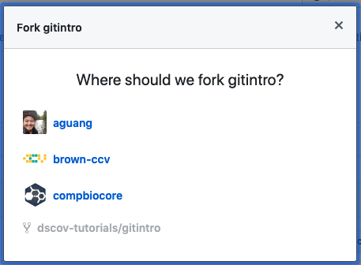
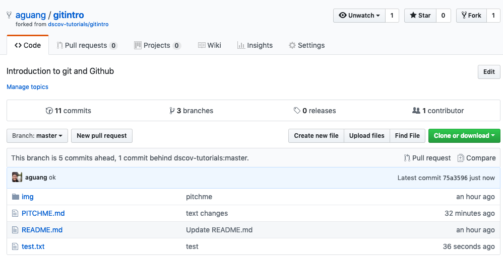
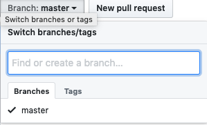

# Intro to @fa[git]
## August Guang

---

## What is @fa[git]?

@ul

 - open source version control tool written by Linus Torvalds (@fa[linux])
 - **version control:** tracks and manages changes to documents, computer programs, and other collections of information

@ulend

---

## Why use git?

@ul

 * Tracking changes over time
 * Helps with collaboration on the same software
 * Protect stable/production code from bugs

@ulend

---

## Webhosts

@size[3.5em][@fa[gitlab]](https://about.gitlab.com)
*Gitlab*
@size[3.5em][@fa[github]](https://github.com)
*Github*
@size[3.5em][@fa[bitbucket]](https://bitbucket.org)
*Bitbucket*

---

## @fa[git] basics - Forking

 * First, let's create our own copy of the repository this presentation is hosted on by **forking** it.
 * Forking a repository is done when you want to a copy of a repository that someone else owns but you want to make your own changes to it for your own purposes.

Go to the Github repo of this tutorial: [https://github.com/dscov-tutorials/gitintro](https://github.com/dscov-tutorials/gitintro).

+++

Click on the Fork button in the upper right.



+++

It will ask where you want to fork it to. Pick your own account.



+++

After a bit, Github will redirect you to a complete copy of this repo, but now owned by you. You can tell it is a fork because it will say at the top in small font "forked from dscov-tutorials/gitintro".


Go ahead and clone the repository by going to the terminal and typing in the below.

```bash
git clone https://github.com/$USERNAME/gitintro.git
```

(In general you can get a clone address by clicking the green **Clone or download** icon on your repo's github page)

---

## @fa[git] basics

 * **repository or repo:** where documents, software, etc is stored and the changes are tracked

```text
gitintro
├── img
|   └── images.png
├── PITCHME.md
└── README.md
```

---


@size[0.5em][https://hoantran-it.blogspot.com/2016/06/git-tutorial-1-git-committing-and.html](https://hoantran-it.blogspot.com/2016/06/git-tutorial-1-git-committing-and.html)


---

```bash
# check status of your git repo including what's changed
# and what's not being tracked
git status
# add file contents to be ready to be committed
git add FILE 
# commit file contents to the local repository
git commit FILE
# commit all added/modified/deleted file contents with
# specific message
git commit -a -m "commit message"
# push file contents to the remote (i.e. cloud) repository
git push 
```

+++

`git status` reveals that everything is up to date.

```diff
On branch master
Your branch is up to date with 'origin/master'.

nothing to commit, working tree clean
```

```text
Working Directory       | Local                   | Remote
 ---                    | ---                     |
gitintro                | gitintro                | gitintro
├── img                 | ├── img                 | ├── img     
|   └── images.png      | |   └── images.png      | |   └── images.png
├── PITCHME.md          | ├── PITCHME.md          | ├── PITCHME.md 
└── README.md           | └── README.md           | └── README.md 
```

+++

Let's create a file.

```bash
echo "test" > test.txt
git status
```

```diff
On branch master
Your branch is up to date with 'origin/master'.

Untracked files:
  (use "git add <file>..." to include in what will be committed)

    - test.txt

nothing added to commit but untracked files present (use "git add" to track)
```

```text
Working Directory       | Local                   | Remote
 ---                    | ---                     |
 gitintro               |  gitintro               |  gitintro 
 ├── img                |  ├── img                |  ├── img
 |   ├── images.png     |  |   ├── images.png     |  |   ├── images.png
 ├── test.txt           |  └── README.md          |  └── README.md
 └── README.md          |                         |
```


+++

`git add test.txt` adds the file to the staging area.

```bash
git add test.txt
git status
```

```bash
On branch master
Your branch is up to date with 'origin/master'.

Changes to be committed:
  (use "git reset HEAD <file>..." to unstage)

    new file:  test.txt/
```

```text
Working Directory       | Local                   | Remote
 ---                    | ---                     |
 gitintro               |  gitintro               |  gitintro 
 ├── img                |  ├── img                |  ├── img
 |   ├── images.png     |  |   ├── images.png     |  |   ├── images.png
 ├── test.txt           |  └── README.md          |  └── README.md
 └── README.md          |                         |
```

+++

`git commit -a -m "test.txt"` actually commits it to local repo.

```bash
git commit -a -m "test.txt"
git status
```

```diff
On branch master
Your branch is ahead of 'origin/master' by 1 commit.
  (use "git push" to publish your local commits)

nothing to commit, working tree clean
```

```text
Working Directory          | Local                      |   Remote
 ---                       | ---                        |
 gitintro                  |  gitintro                  |  gitintro 
 ├── img                   |  ├── img                   |  ├── img
 |   ├── images.png        |  |   ├── images.png        |  |   ├── images.png
 ├── test.txt              |  ├── test.txt              |  └── README.md 
 └── README.md             |  └── README.md             |  
```

+++

`git log` will show a log of everyone's commits and messages.

```diff
commit 335531d99fd3987a169121307965e28e75de4dbf (HEAD -> master, origin/master, origin/HEAD)
Author: August Guang <august.guang@gmail.com>
Date:   Wed Mar 13 13:56:59 2019 -0400

    test.txt

(and so on)
```

+++
@title[git push]

`git push origin master` pushes everything from the local repository to the remote repository.

```bash
git push origin master
```

```diff
Counting objects: 3, done.
Delta compression using up to 8 threads.
Compressing objects: 100% (2/2), done.
Writing objects: 100% (3/3), 274 bytes | 274.00 KiB/s, done.
Total 3 (delta 1), reused 0 (delta 0)
remote: Resolving deltas: 100% (1/1), completed with 1 local object.
To https://github.com/aguang/gitintro.git
   2fb5c0d..335531d  master -> master
```

```bash
git status
```

```diff
On branch master
Your branch is ahead of 'origin/master' by 1 commit.
  (use "git push" to publish your local commits)
```

+++
@title[git push]

```text
Working Directory          | Local                      |   Remote
 ---                       | ---                        |
 gitintro                  |  gitintro                  |  gitintro 
 ├── img                   |  ├── img                   |  ├── img
 |   ├── images.png        |  |   ├── images.png        |  |   ├── images.png
 ├── test.txt              |  ├── test.txt              |  ├── test.txt 
 └── README.md             |  └── README.md             |  └── README.md
```

---

@title[local-remote]


---

@title[Commands for pulling from remote]

```bash
# pull data from remote repo into local repo
git fetch
# tells you what branch you have locally and what
# branch your working directory is on
git branch
# tells you what branch you have remotely
git branch -r
# used to navigate between branches on the local repo
# need to run git fetch first to pull in branches
git checkout branch
# merges data from local repo into working directory
git merge
# used to create a new branch
git checkout -b NEW_BRANCH
# combines fetch & merge all at once
git pull
```

+++

Let's first make a new branch called `example` on Github and add a file `newfile`. Go back to the view of your repository on the browser. It should look like you have a file `test.txt` in it now.



+++

Click on the Branch: **master** icon. A window will appear with the ability to type in a new branch name. Type in `example`.



+++

Now you have and are on a new branch called `example`. Click on the "Create new file" icon. This will take you to an editing screen. Type in "newfile" inside Name your file... and put whatever you want into the blank text underneath.


Then scroll down and hit the green "Commit new file" button.


+++

You have now created a new file `newfile` inside the branch `example` *remotely*. So how do we get it into local?

+++

Current structure

```diff
+ remote
master                 | example                   
 ---                   | ---                       
 gitintro              |  gitintro                  
 ├── img               |  ├── img           
 |   ├── images.png    |  |   ├── images.png 
 ├── test.txt          |  ├── newfile
 └── README.md         |  └── README.md                                           
     

- local
master
 ---                                          
 gitintro                                 
 ├── img                 
 |   ├── images.png
 ├── test.txt                                      
 └── README.md          

- working directory
master
 ---                                          
 gitintro                                 
 ├── img                 
 |   ├── images.png 
 ├── test.txt                              
 └── README.md                
```
+++

`git branch` tells you what branch you are on. `git branch -r` tells you what you have in your remote.

```bash
git branch
git branch -r
```

```bash
(base) aguang@cis240l0htdh:~/CORE/workshops/dscov/test/gitintro$ git branch
* master
(base) aguang@cis240l0htdh:~/CORE/workshops/dscov/test/gitintro$ git branch -r
  origin/HEAD -> origin/master
  origin/master
```

+++

`git fetch` pulls data from remote repo into local repo.

```bash
git fetch
```

```bash
From https://github.com/aguang/gitintro
 * [new branch]      example        -> origin/example
 ```

```diff
+ remote
master                 | example                    
 ---                   | ---                       
 gitintro              |  gitintro                  
 ├── img               |  ├── img           
 |   ├── images.png    |  |   ├── images.png 
 ├── test.txt          |  ├── newfile    
 └── README.md         |  └── README.md                                       

- local
master                 | example                    
 ---                   | ---                       
 gitintro              |  gitintro                  
 ├── img               |  ├── img           
 |   ├── images.png    |  |   ├── images.png 
 ├── test.txt          |  ├── newfile                                         
 └── README.md         |  └── README.md  

- working directory
master
 ---                                          
 gitintro                                 
 ├── img                 
 |   ├── images.png                              
 └── README.md                
```

+++

```bash
git branch
git branch -r
```

```bash
(base) aguang@cis240l0htdh:~/CORE/workshops/dscov/test/gitintro$ git branch
* master
(base) aguang@cis240l0htdh:~/CORE/workshops/dscov/test/gitintro$ git branch -r
  origin/HEAD -> origin/master
  origin/example
  origin/master
```

+++

`git checkout example` pulls in an exact copy from local.

```bash
git checkout example
```

```bash
Branch 'example' set up to track remote branch 'example' from 'origin'.
Switched to a new branch 'example'
```

```diff
+ remote
master                 | example                    
 ---                   | ---                       
 gitintro              |  gitintro                  
 ├── img               |  ├── img           
 |   ├── images.png    |  |   ├── images.png 
 ├── test.txt          |  ├── newfile                                          
 └── README.md         |  └── README.md 

- local
master                 | example                    
 ---                   | ---                       
 gitintro              |  gitintro                  
 ├── img               |  ├── img           
 |   ├── images.png    |  |   ├── images.png 
 ├── test.txt          |  ├── newfile                                           
 └── README.md         |  └── README.md 

- working directory
example
 ---                                          
 gitintro                                 
 ├── img                 
 |   ├── images.png
 ├── newfile                           
 └── README.md
```

+++

`git merge $BRANCH` merges everything from local current branch $BRANCH into working directory.

```diff
+ remote
master                 | example                    
 ---                   | ---                       
 gitintro              |  gitintro                  
 ├── img               |  ├── img           
 |   ├── images.png    |  |   ├── images.png 
 ├── test.txt          |  ├── newfile                                         
 └── README.md         |  └── README.md   

- local
master                 | example                    
 ---                   | ---                       
 gitintro              |  gitintro                  
 ├── img               |  ├── img           
 |   ├── images.png    |  |   ├── images.png 
 ├── test.txt          |  ├── newfile                                           
 └── README.md         |  └── README.md 

- working directory
example
 ---                                          
 gitintro                                 
 ├── img                 
 |   ├── images.png
 ├── newfile
 ├── test.txt                                       
 └── README.md
```

+++

If some of your files get overwritten you may get merge conflicts. These you will have to fix file by file and line by line to decide which version you want to keep. The merge conflicts will be marked with text like

```diff
>>>>>>>>>>>HEAD
code_version1
<<<<<<<<<<<commit
code_version2
```

+++

`git checkout -b NEW_BRANCH` creates a new branch locally and switches the working directory over.

```diff
+ remote
master                 | example                    
 ---                   | ---                       
 gitintro              |  gitintro                  
 ├── img               |  ├── img           
 |   ├── images.png    |  |   ├── images.png 
 ├── test.txt          |  ├── newfile                                           
 └── README.md         |  └── README.md

- local
master                 | example                 | NEW_BRANCH   
 ---                   | ---                     | ---   
 gitintro              |  gitintro               | gitintro   
 ├── img               |  ├── img                | ├── img      
 |   ├── images.png    |  |   ├── images.png     | |   ├── images.png
 ├── test.txt          |  ├── newfile            | ├── newfile                 
 └── README.md         |  └── README.md          | └── README.md

- working directory
NEW_BRANCH
 ---                                          
 gitintro                                 
 ├── img                 
 |   ├── images.png
 ├── newfile                           
 └── README.md                
```

+++

`git branch` tells you what branch you are on, this time with `NEW_BRANCH` added.

```bash
git branch
* NEW_BRANCH
  example
  master
```

+++

Note: when pushing changes from `NEW_BRANCH` to remote for first time, you must use `git push origin NEW_BRANCH` in order to set a new (upstream) remote example. Otherwise you will get this error:

```diff
git push
fatal: The current branch NEW_BRANCH has no upstream example.
To push the current branch and set the remote as upstream, use

    git push --set-upstream origin NEW_BRANCH
```

---

# @fa[git] workflows

---

## gitflow

+++


@size[0.5em][https://www.atlassian.com/git/tutorials/comparing-workflows/gitflow-workflow](https://www.atlassian.com/git/tutorials/comparing-workflows/gitflow-workflow)

+++


+++


+++


---

## github flow

[https://guides.github.com/introduction/flow/](https://guides.github.com/introduction/flow/)

---

# fun things

---

## Slack @fa[slack] integration

@ul

 * Can subscribe a channel to a Github repository so everyone in the channel sees commits, pushes, etc and can comment on them
 * Useful for individual projects

@ulend

---?code=src/gitpitch.md

---

## Other integrations: travis, codecov, notebooks

[http://github.com/aguang/transmissim](http://github.com/aguang/transmissim)

---

# Learn more

 * Generally @fa[stack-overflow](http://www.stackoverflow.com) is where I have acquired all of my git knowledge.
 * Atlassian also has [great explanations of everything](https://www.atlassian.com/git/tutorials/using-examplees/git-checkout)